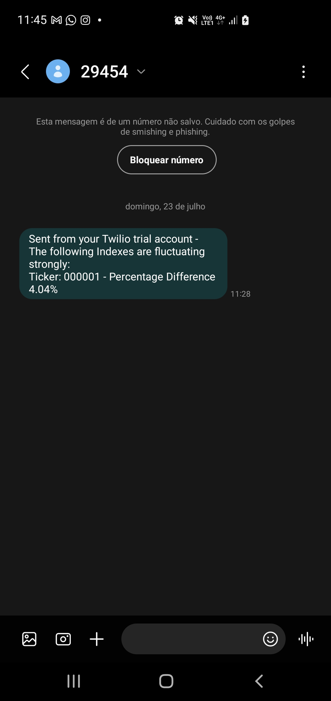

# stock-market-alert
Application that connect two different APIs: stock market data and message apps to send alerts for variations in the stock markets to the user mobile phone.

I have been fascinated for the financial markets since I was a child, being an investor for a long time now. Due to my studies and personal journey, I do understand that despite all the issues that arises with financial crisis, they might as well come with opportunities.

For this reason and also to put in practice some of my coding skills while using APIs, I decided to create the "stock market alert" or "circuit breaker app" to send me notifications whenever the major global indexes are down more than a pre setted threshold.

## Can I get alerts myself too?

Sure, in the next steps I will guide my dear visitors and followers on a how to step by step.

1. Generate an API key in one stock market website such as [marketstack](https://marketstack.com/). At the time being, it is possible to use the free plan to make 1000 monthly requests to get stock data from 170,000+ tickers around the world. Add your KEY for the stock market API and the other config variables to the env_template.cfg file.

2. To query the intraday API, we will also need to add the tickers we want to get information for, as per the example request below: 

```
// Intraday Data API Endpoint

http://api.marketstack.com/v1/intraday
    ? access_key = YOUR_ACCESS_KEY
    & symbols = AAPL
    
// optional parameters: 

    & interval = 1h
    & sort = DESC
    & date_from = YYYY-MM-DD
    & date_to = YYYY-MM-DD
    & limit = 100
    & offset = 0
```

Given this, you will need to update the indexes.csv file with the indexes and ticker codes you want to monitor. Example lists can be found inside [TradingView](https://www.tradingview.com/markets/indices/quotes-major/), [Wikipedia](https://en.wikipedia.org/wiki/List_of_stock_market_indices) or other Financial Markets websites.

3. Now, we will make API calls for each of the tickers to the API and temporarily store the results using the stock-market-alert notebook. Indexes with responses above the threshold (defined as a 3% varation between the opening price and current intraday price) will have their labels and results stored inside a dictionary.

4. Still inside the notebook, we will use Twilio APIs to send a summary of the above results to a target phone number. At the time being, Twilio offers ~15$ in credits and the capability of sending messages both via WhatsApp and SMS APIs. In this project I decided to use the SMS one for simplification purposes as WhatsApp is not enabled in Twilio accounts by default. However, a "next step" to improving this project could be to enable the WhatsApp API instead, as the free credits would let me send ~3000 WhatsApp messages instead of ~250 SMS. It is recommended to do your own research as costs may vary by country.



5. Finally, now that we know our notebook works, it is time to host the code in the cloud and schedule it to run periodically, so we can effectively receive our notifications when indexes are fluctuating heavily. There are many providers we could use to perform this task, including some that provide direct notebook support, but I will stick with [PythonAnywhere](https://www.pythonanywhere.com/) as I understand it is a good free option. 

For this, it will be necessary to transform the notebook into a python file so we can upload the main.py, indexes.csv, and the env.cfg file to the python anywhere environment. After uploading the files, we can easily schedule the task to be run once a day (free account) or more granularly using a premium account.

